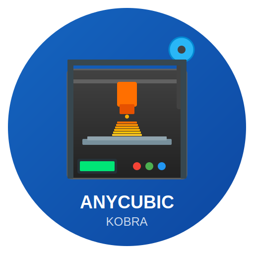

# ioBroker.anycubic-kobra



[](https://www.npmjs.com/package/iobroker.anycubic-kobra)
[](https://github.com/iobroker-community-adapters/ioBroker.anycubic-kobra/blob/main/LICENSE)

## Anycubic Kobra 3D-Drucker Adapter für ioBroker

Dieser Adapter ermöglicht die Steuerung und Überwachung von Anycubic Kobra 3D-Druckern über ioBroker.

### Unterstützte Drucker

| Modell | Cloud-Modus | LAN-Modus | Kamera |
|--------|-------------|-----------|--------|
| Kobra S1 | ✅ | ✅ | ✅ |
| Kobra S1 Combo | ✅ | ✅ | ✅ |
| Kobra 3 | ✅ | ✅ | ✅ |
| Kobra 3 Combo | ✅ | ✅ | ✅ |
| Kobra 2 | ✅ | ✅ | ❌ |
| Kobra 2 Pro | ✅ | ✅ | ❌ |
| Kobra 2 Max | ✅ | ✅ | ❌ |

## Installation

### Über ioBroker Admin

1. Öffnen Sie ioBroker Admin
2. Gehen Sie zu **Adapter**
3. Suchen Sie nach **anycubic-kobra**
4. Klicken Sie auf **Installieren**

### Manuelle Installation

```bash
cd /opt/iobroker
iobroker add anycubic-kobra
```

## Konfiguration

### Verbindungsmodi

Der Adapter unterstützt zwei Verbindungsmodi:

#### 1. Cloud-Modus (Empfohlen)

Verbindung über die Anycubic Cloud Server. Dieser Modus bietet:
- Echtzeit-Updates über MQTT
- Zugriff auf alle Cloud-Funktionen
- Funktioniert auch außerhalb des Heimnetzwerks

**Cloud-Token erhalten:**

1. Installieren Sie **Anycubic Slicer Next** (Windows-Version)
   - Download: [Anycubic Slicer Next](https://www.anycubic.com/pages/anycubic-slicer)

2. Melden Sie sich mit Ihrem Anycubic-Konto an

3. Öffnen Sie die Konfigurationsdatei:
   ```
   %AppData%\AnycubicSlicerNext\AnycubicSlicerNext.conf
   ```

4. Suchen Sie den Eintrag `"access_token"` und kopieren Sie den Wert (344 Zeichen)

5. Fügen Sie den Token in der Adapter-Konfiguration ein

#### 2. LAN-Modus (Lokal)

Direkte Verbindung im lokalen Netzwerk ohne Cloud:

1. **LAN-Modus am Drucker aktivieren:**
   - Gehen Sie zu: `Einstellungen` > `Netzwerk` > `LAN-Modus`
   - Aktivieren Sie den LAN-Modus
   - Notieren Sie die angezeigte IP-Adresse

2. **Drucker in der Adapter-Konfiguration hinzufügen:**
   - Name: Ein beliebiger Name für den Drucker
   - Modell: Ihr Druckermodell auswählen
   - IP-Adresse: Die IP-Adresse des Druckers

**Hinweis:** Im LAN-Modus sind Cloud-Funktionen und die mobile App nicht verfügbar.

## Objekte und Datenpunkte

Nach der Einrichtung werden für jeden Drucker folgende Objekte erstellt:

### Info (`{printer_id}.info`)

| Datenpunkt | Beschreibung | Typ |
|------------|--------------|-----|
| `name` | Druckername | string |
| `model` | Druckermodell | string |
| `status` | Aktueller Status | string |
| `online` | Online-Status | boolean |
| `firmware` | Firmware-Version | string |

### Temperatur (`{printer_id}.temperature`)

| Datenpunkt | Beschreibung | Einheit |
|------------|--------------|---------|
| `nozzle` | Düsentemperatur | °C |
| `nozzleTarget` | Düsen-Sollwert | °C |
| `bed` | Betttemperatur | °C |
| `bedTarget` | Bett-Sollwert | °C |
| `chamber` | Kammertemperatur | °C |

### Druckauftrag (`{printer_id}.job`)

| Datenpunkt | Beschreibung | Einheit |
|------------|--------------|---------|
| `name` | Dateiname | string |
| `progress` | Fortschritt | % |
| `layer` | Aktuelle Schicht | number |
| `totalLayers` | Gesamtschichten | number |
| `timeElapsed` | Verstrichene Zeit | s |
| `timeRemaining` | Verbleibende Zeit | s |
| `printSpeed` | Druckgeschwindigkeit | % |

### Steuerung (`{printer_id}.control`)

| Datenpunkt | Beschreibung | Typ |
|------------|--------------|-----|
| `pause` | Druck pausieren | button |
| `resume` | Druck fortsetzen | button |
| `stop` | Druck abbrechen | button |
| `light` | Beleuchtung | switch |
| `fan` | Lüftergeschwindigkeit | 0-100 |

### Kamera (`{printer_id}.camera`)

| Datenpunkt | Beschreibung |
|------------|--------------|
| `streamUrl` | URL des Kamera-Streams |

## Verwendung in VIS

### Kamera-Stream einbinden

Der Kamera-Stream des Kobra S1 kann in VIS eingebunden werden:

```html
<video autoplay muted>
    <source src="{anycubic-kobra.0.printer_id.camera.streamUrl}" type="video/x-flv">
</video>
```

Oder mit dem Basic - iFrame Widget und der Stream-URL.

### Beispiel-Dashboard

Ein Beispiel-Dashboard finden Sie unter `examples/vis-dashboard.json`.

## Skript-Beispiele

### Benachrichtigung bei Druckende

```javascript
on({id: 'anycubic-kobra.0.*.job.progress', change: 'ne'}, function(obj) {
    if (obj.state.val === 100) {
        sendTo('telegram.0', {
            text: '3D-Druck abgeschlossen!'
        });
    }
});
```

### Automatische Beleuchtung

```javascript
on({id: 'anycubic-kobra.0.*.info.status', change: 'ne'}, function(obj) {
    const printerId = obj.id.split('.')[2];
    if (obj.state.val === 'printing') {
        setState(`anycubic-kobra.0.${printerId}.control.light`, true);
    }
});
```

## Fehlerbehebung

### Verbindung schlägt fehl

1. **Cloud-Modus:**
   - Überprüfen Sie den Cloud-Token (muss 344 Zeichen lang sein)
   - Stellen Sie sicher, dass der Token nicht abgelaufen ist
   - Testen Sie die Verbindung mit dem "Verbindung testen" Button

2. **LAN-Modus:**
   - Stellen Sie sicher, dass der LAN-Modus am Drucker aktiviert ist
   - Überprüfen Sie, ob die IP-Adresse korrekt ist
   - Stellen Sie sicher, dass Drucker und ioBroker im selben Netzwerk sind

### MQTT-Verbindung instabil

- Anycubic blockiert teilweise MQTT-Verbindungen von Drittanbietern
- Versuchen Sie, den Token zu erneuern
- Reduzieren Sie das Abfrageintervall

### Kamera-Stream funktioniert nicht

- Nur für Kobra S1 und neuere Modelle verfügbar
- Stream-Port: 18088
- Format: FLV (Flash Video)

## Technische Details

### API-Endpunkte

| Service | URL/Port |
|---------|----------|
| Cloud API | `https://cloud-universe.anycubic.com` |
| MQTT Broker | `mqtts://mqtt-universe.anycubic.com:8883` |
| Kamera Stream | `http://{printer_ip}:18088/flv` |

### Netzwerkanforderungen

- **WiFi:** Nur 2.4 GHz (5 GHz wird nicht unterstützt)
- **Ports:** 8883 (MQTT), 18088 (Kamera)
- **Protokoll:** MQTT mit TLS

## Changelog

### 1.0.0 (2024-XX-XX)
- Erstveröffentlichung
- Unterstützung für Kobra S1, Kobra 3 und weitere Modelle
- Cloud- und LAN-Modus
- Echtzeit-Updates über MQTT
- Kamera-Integration für unterstützte Modelle

## Lizenz

MIT License

Copyright (c) 2024 MiniMax Agent

Permission is hereby granted, free of charge, to any person obtaining a copy
of this software and associated documentation files (the "Software"), to deal
in the Software without restriction, including without limitation the rights
to use, copy, modify, merge, publish, distribute, sublicense, and/or sell
copies of the Software, and to permit persons to whom the Software is
furnished to do so, subject to the following conditions:

The above copyright notice and this permission notice shall be included in all
copies or substantial portions of the Software.

THE SOFTWARE IS PROVIDED "AS IS", WITHOUT WARRANTY OF ANY KIND, EXPRESS OR
IMPLIED, INCLUDING BUT NOT LIMITED TO THE WARRANTIES OF MERCHANTABILITY,
FITNESS FOR A PARTICULAR PURPOSE AND NONINFRINGEMENT. IN NO EVENT SHALL THE
AUTHORS OR COPYRIGHT HOLDERS BE LIABLE FOR ANY CLAIM, DAMAGES OR OTHER
LIABILITY, WHETHER IN AN ACTION OF CONTRACT, TORT OR OTHERWISE, ARISING FROM,
OUT OF OR IN CONNECTION WITH THE SOFTWARE OR THE USE OR OTHER DEALINGS IN THE
SOFTWARE.
